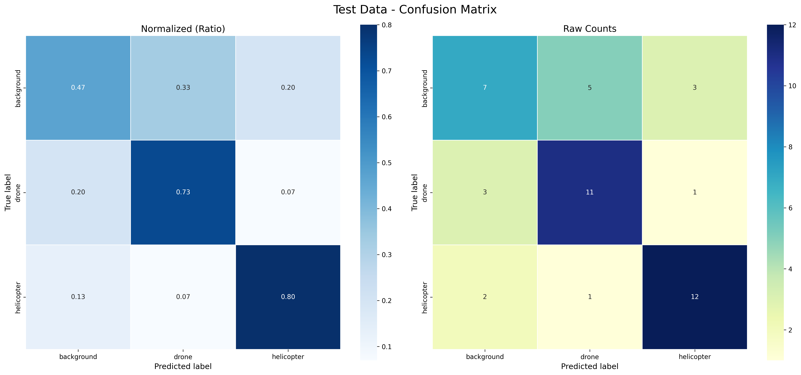
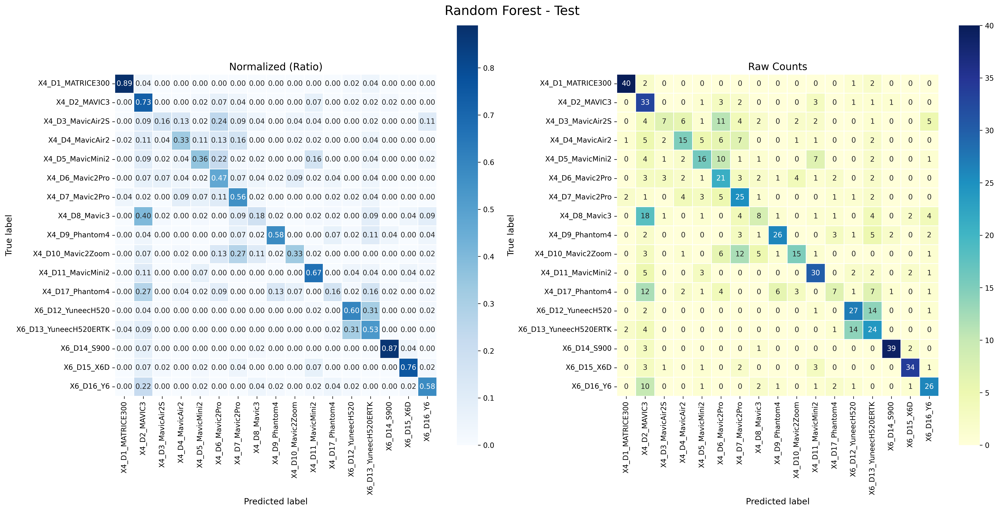

# drone-mfcc-detection

Drone classification using MFCC ("mel-frequency cepstral coefficients"). `drone_classification.py` differentiates drones from helicopters and noise, and `model_classification.py` differentiates different drone models.

## Results





## Setup

Be sure to use a virtual environment:
> ```sh
> $ python3 -m venv venv
> ```
(Here, `venv` is just an example, the virtual environment can be given *any* name).

Activate the virtual environment:
> ```sh
> $ source venv/bin/activate
> ```

Upon activation, run `pip list`. Only `pip` and `setuptools` should be installed in the virtual environment.

Install requirements:
> ```sh
> $ pip install -r requirements.txt
> ```

## Classify drones:

`cd` into the `main` directory:
> ```sh
> $ cd main
> ```

Run `drone_classification.py`:
> ```sh
> $ python3 drone_classification.py
> ```

Six `png` filess will be saved to the results folder:
- `_train_confusion_matrix_normalized.png` — single heatmap, training data, values as proportions (0.0–1.0).
- `_train_confusion_matrix_counts.png` — single heatmap, training data, values as raw file counts.
- `_train_confusion_matrix_comparison.png` — side-by-side of the above two, training data.
- `_test_confusion_matrix_normalized.png` — single heatmap, test data, values as proportions.
- `_test_confusion_matrix_counts.png` — single heatmap, test data, values as raw file counts.
- `_test_confusion_matrix_comparison.png` — side-by-side of the above two, test data.

Note that each `png` is prefaced with a timestamp (e.g. `20260504_143022_`).

## Classify drone models:

`cd` into the `main` directory:
> ```sh
> $ cd main
> ```

Run `model_classification.py`:
> ```sh
> $ python3 model_classification.py
> ```